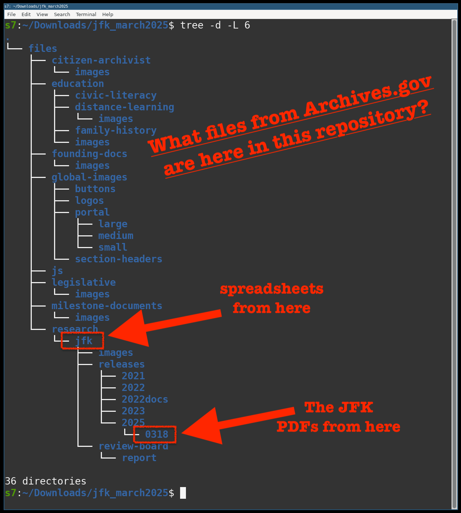
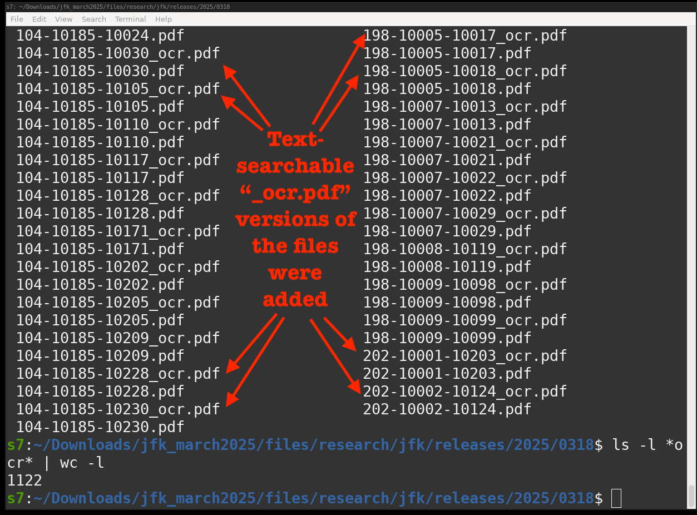

# What is this?
On 18March2025 by Presidential Executive Order, previously classified JFK documents were declassified and made public at this URL:
https://www.archives.gov/research/jfk/release-2025
Although the documents were ordered to not be redacted, the released versions were not text searchable. The contents of this repository
are text-searchable versions of those PDFs as well as selected NLP/ML analysis of those documents.

# More info
See tweet: TBD

For the last few years (to assist my research) I have been writing a custom "quasi-AI" (NLP/ML) software tool that analzes and finds connections in historical documents (mostly books, but also audio and video).
I have not shared this tool publicly (nicknamed "Abulafia"), but have shared some smaller precursor pieces of it, for example:
- GoalPost https://github.com/s7ephen/goalpost
- https://github.com/s7ephen/bookmark2screenshot
- https://github.com/s7ephen/calibreweb_dockerizer
- OfflineImageSearch https://github.com/s7ephen/seacrane/wiki#ocr-images-in-a-directory

Anyway, I let this private tool loose on the new JFK document trove and had it spit out analysis, some visualizations, and some post-processed output.
Some of that "post-processing" include the text-searchable OCR'd version of the PDFs, which might be generally useful to people.

- So the PDFs were [downloaded with this](jfkmirror_politely.sh).
- They were then fed to Abulafia.
- After ~30 hours of processing, some of Abulafia's output was shared here.

Abulafia tries to make connections to things "outside" the scope of these documents, so handpicked stuff will be placed in this public repo.

## TL;DR
So, TL;DR: This repo is a place for *some* of the post-processed output (and analysis) of the JFK documents, which includes the text searchable PDFs.

# Files here:
Relative to a archives.gov mirror, here's what is in this repo:

## Whats here:

