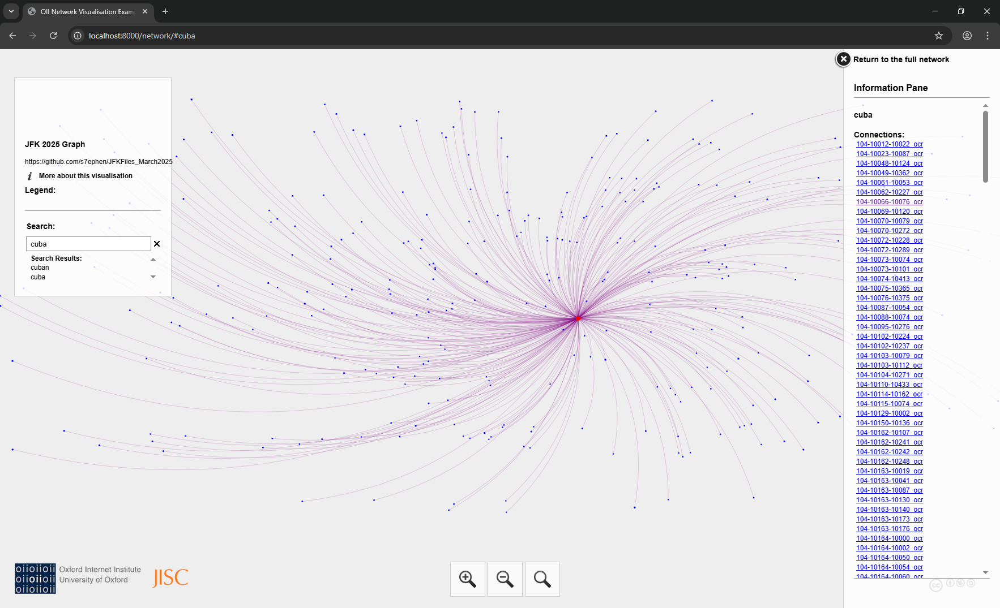

# What is this?
On 18March2025 by Presidential Executive Order, previously classified JFK documents were declassified and made public at this URL:
https://www.archives.gov/research/jfk/release-2025
Although the documents were ordered to not be redacted, the released versions were not text searchable. The contents of this repository
are text-searchable versions of those PDFs as well as selected NLP/ML analysis of those documents.

## TL;DR
So, TL;DR: This repo is a place for *some* of the post-processed output (and analysis) of the JFK documents, which includes the text searchable PDFs.

- Viz is here: https://s7ephen.com/JFK_2025
- Text-Searchable [JFK2025 PDFs here](./0318) 
- Jump down to [More Info](#more-info) for how all this stuff was generated.

# Visualizations

There are many ways to view and search in this data. Most immediately,
there are pregenerated visualizations hosted here:
- https://s7ephen.com/JFK_2025

## 1. Download and view with Gephi Desktop
You can view, search and manipulate the graphs using your own computer (offline) by:
- Installing [Gephi Desktop (free)](https://gephi.org) 
- Then download this [this directory](./graphs) and open the `.gefx`, `.gml`, or `.graphml` files. (there are a number of pregenerated graphs in that directory based on filesize (quantity of nodes).

It will give you graphs like this:

## 2. Use Gephi's Web-based viewer
If you dont want to install any software Gephi offers a [lightweight web-viewer here](http://gephi.org/gephi-lite/) Just:
- Download [this directory](./graphs) and upload the `.graphml` file you want to start viewing and querying.

It will give you graphs like this:

## 3. Use the pregenerated Web-Graphs:
The same visualizations hosted here: https://s7ephen.com/JFK_2025 are also in this repository, so you can:
- download [this directory](./pregenerated_web_graphs)
- view it by serving the directory using your existing webserver or `python3 -m http.server` or `python2 -m SimpleHTTPServer`
- or if you dont have python you can use [Seacrane](https://github.com/s7ephen/seacrane)'s [http server](https://github.com/s7ephen/seacrane/wiki#share-a-directory-via-http-httpdir)

You will get visualizations like this:

# More info
See tweet: https://x.com/s7ephen/status/1903160996731957279 

For the last few years (to assist my research) I have been writing a custom "quasi-AI" (NLP/ML) software tool that analzes and finds connections in historical documents (mostly books, but also audio and video).
I have not shared this tool publicly (temporarily nicknamed ["Abulafia"](https://en.wikipedia.org/wiki/Foucault%27s_Pendulum#Plot_summary)), but have shared some smaller precursor pieces of it, for example:
- GoalPost https://github.com/s7ephen/goalpost
- https://github.com/s7ephen/bookmark2screenshot
- https://github.com/s7ephen/calibreweb_dockerizer
- OfflineImageSearch https://github.com/s7ephen/seacrane/wiki#ocr-images-in-a-directory

Anyway, I let this private tool loose on the new JFK document trove and had it spit out analysis, some visualizations, and some post-processed output.
Some of that "post-processing" include the text-searchable OCR'd version of the PDFs, which might be generally useful to people.

- So the PDFs were [downloaded with this](jfkmirror_politely.sh).
- They were then fed to Abulafia.
- After ~30 hours of processing, some of Abulafia's output was shared here.

Abulafia tries to make connections to things "outside" the scope of these documents (in my personal research vault), so manually handpicked stuff will be placed in this public repo.

# Files here:
|File pattern or name | Description | 
|-|-|
|`*_ocr.pdf`| Text searchable version of file by the same name (sans "_ocr") from Archives.gov E.G. [104-10173-10132_ocr.pdf](./0318/104-10173-10132_ocr.pdf) corresponds to [104-10173-10132.pdf (on Archives.gov)](https://www.archives.gov/files/research/jfk/releases/2025/0318/104-10173-10132.pdf) |
|`*.proper_nouns.txt`| Proper nouns extracted from the PDF, this includes Organization abbreviations, or algorithmic guesses at any of these.|
|`*.proper_nouns_with_popularity_count.json` | All the proper nouns sorted uniquely with their number of occurences in the document.|
|`*.proper_nouns_normalized_popularity_count.json` | Proper nouns "normalized" algorithmically (removing case, punctuation, and calculating "string sameness" (Levenstein distance, et al)) and then sorted for popularity. E.G. `"E. Howard Hunt"` becomes equal to `"howard hunt, e"`
|`normalized_global_propernoun_list_with_popularities_sorted.json`| All proper nouns extracted from all the documents, normalized, and sorted by popularity with occurence counts.|
| `JFKFiles_March2025.gefx` | Graph database for viz and search |

## Whats here (relative to Archives.gov mirror):

